# Wildflour-Pâtisserie

Wildflour-Pâtisserie is a two-in-one website. 

On one hand in the recipes section, targeting amateurs and intermediate bakers provide recipes of classic French cakes and desserts, modern modifications to classic recipes, and sharing personal experience of trying out recipes of popular French pastry chefs.

On the other hand, it also works as a blog. In "Life As A Pastry Student", the main purpose is to inform, educate and entertain the audience. Here people with a passion for baking will find personal insights into the everyday life of being a pastry student, sharing tips and techniques on how to improve baking skills and outlook on life as a future pastry chef.

## [View Website in Github pages](https://dimicoding.github.io/Wildflour/)

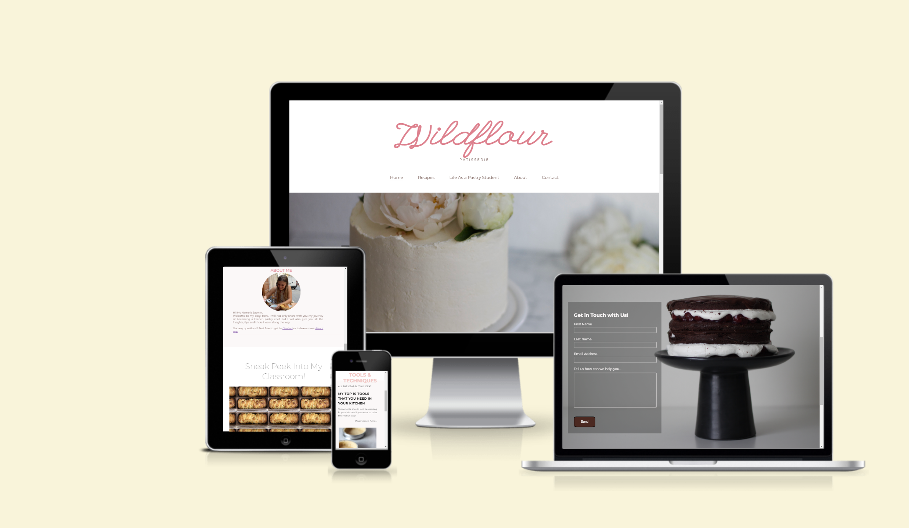

# Table of Contents

- [UX](#ux)
    - [Target Audience](#target-audience)
    - [Website owner business goals](#website-owner-business-goals)
    - [User goals](#user-goals)
        - [New user goals](#new-user-goals)
        - [Returning user goals](#returning-user-goals)
        - [Website owner business goals](#website-owner-business-goals)
    - [Structure of the website](#structure-of-the-website)
    - [Wireframes](#wireframes)
    - [Surface](#surface)
        - [Color](#colors)
        - [Fonts](#fonts)
        - [Images](#images)
- [Features](#features)
    - [Nav Bar](#navigation-bar)
    - [The Landing Page](#the-landing-page)
    - [First Section and Aside](#first-section--recipes-and-aside-section)
    - [Second Section](#second-section--sneak-peek-into-my-classroom)
    - [Footer](#footer)
    - [Recipes page](#recipes-page)
    - [Life As A Pastry Student](#life-as-a-pastry-student)
    - [About Page](#about-page)
    - [Contact Page](#contact)
- [Features Left to Implement](#features-left-to-implement)
- [Testing](#testing)
    - [Validator Testing](#validator-testing)
        - [Lighthouse](#lighthouse)
        - [W3C](#w3c-html)
        - [Jigsaw](#jigsaw-css)
    -[Responsiveness](#responsiveness)
- [Fixed Bugs](#fixed-bugs)
- [Deployment](#deployment)
- [Credits](#credits)
- [Acknowledgments](#acknowledgements)

# UX
## Target Audience
- People in different stages of their baking from beginners to intermediate bakers
- Curious bakers, that want to step up their game and try more complex recipes
- People who wish to have a more profound understanding of baking, also on a
chemical level
- Bakers interested in achieving high-quality products
- People thinking about changing professions to become professional bakers
- People with a general interest in French cuisine

## Website owner business goals:
- Creation of the website will increase the notoriety of the baker to the public.
- Making classic French recipes available to an English-speaking audience.
- Giving out personal insights into studying at one of the most popular French pastry
schools.
- Foresight of future employment possibilities (eg. catering, wedding cakes).

## User Goals

### New User Goals:
- Easy and beginner-friendly classic French recipes.
- The role of qualitative primary products.
- Current trends within the industry, especially in France.

### Returning User Goals: 
- Baking complex French pastries at home, e. g. croissants.
- Choosing a pastry school and program (program, duration, location, price,
language).
- The realistic everyday life of being a pastry student in France.

## Structure Of The Website
Easy to use and intuitive structure permits new users to have a good user experience browsing throughout the site. 
Responsive and adaptive to all types of screens so that the users can access various devices without interference. 

## Wireframes
To create a blueprint for the project I used Word and Balsamiq wireframes

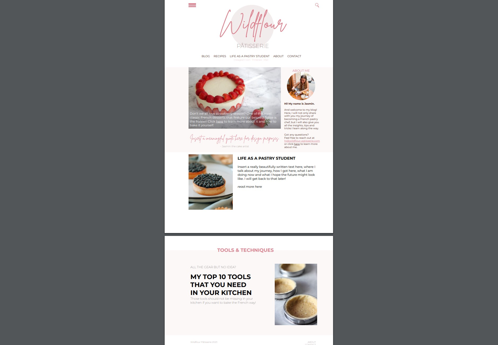

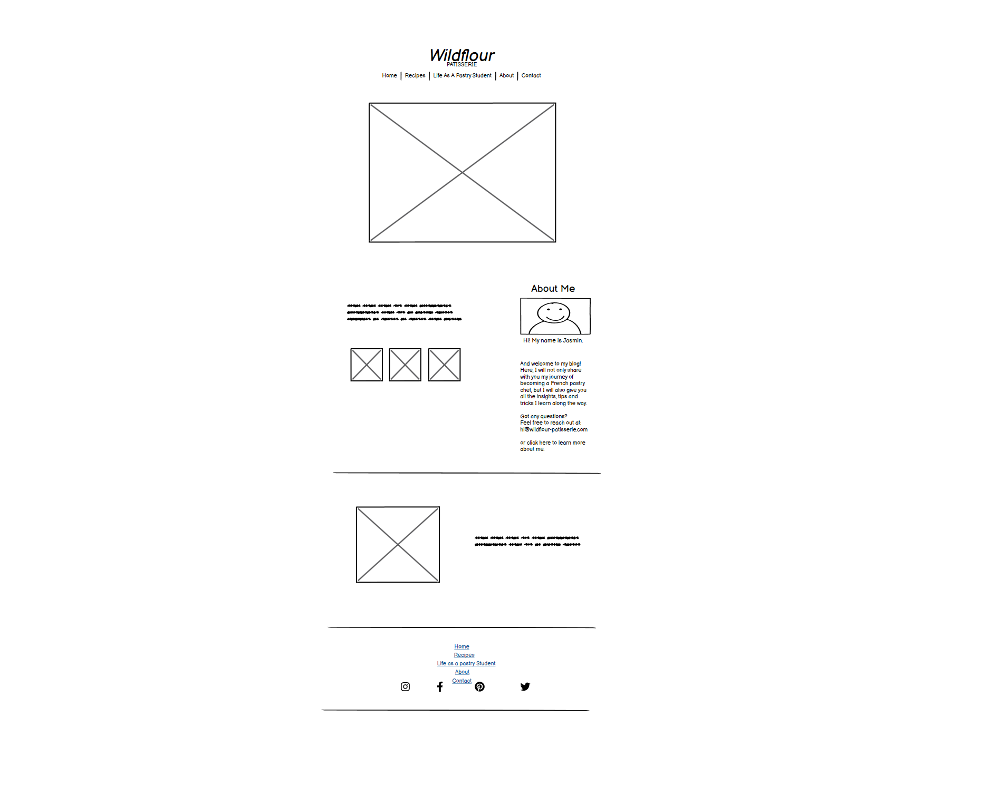

## Surface

### Colors
Main colors used in this project:

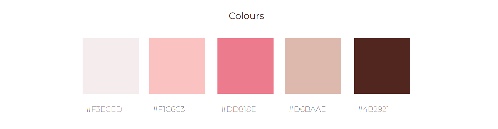

### Fonts
- Headline 1 font wasn't available for free use, in this case, for the main title I used League Script.
- Sub-Headings: Montserrat.
- Backup font: sans-serif, cursive.

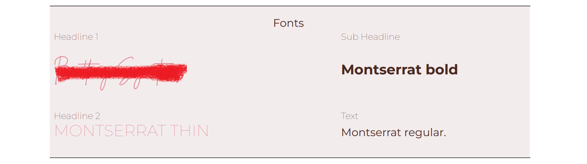

### Images
All the images used on this website are of private use.

# Features

## Navigation Bar
Displayed on all 5 pages of the website, it's fully responsive and has a light underlining color when hovering and when the page is active. From here the user can easily go to Home, Recipes, Life as a Pastry Student, About, and Contact pages.
The main logo, when clicked also redirects to the home page.

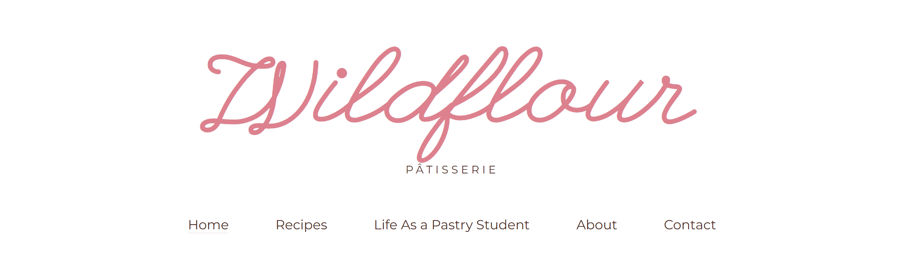

## The Landing Page
Includes an image to activate curiosity when the user first lands on this website and promote him to scroll down the page.

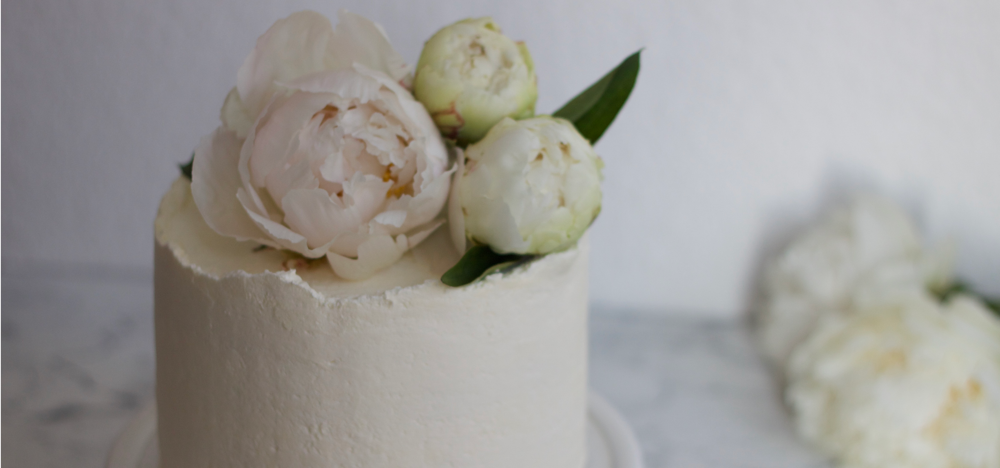

## First Section- Recipes and Aside Section
- On the left side is displayed a section with a big title, three sample images, and a link that redirects the users to the recipes page.
- On the right side, the aside section presents a brief presentation of the author of the recipes and two links to go to the "contact" and "about" pages. 

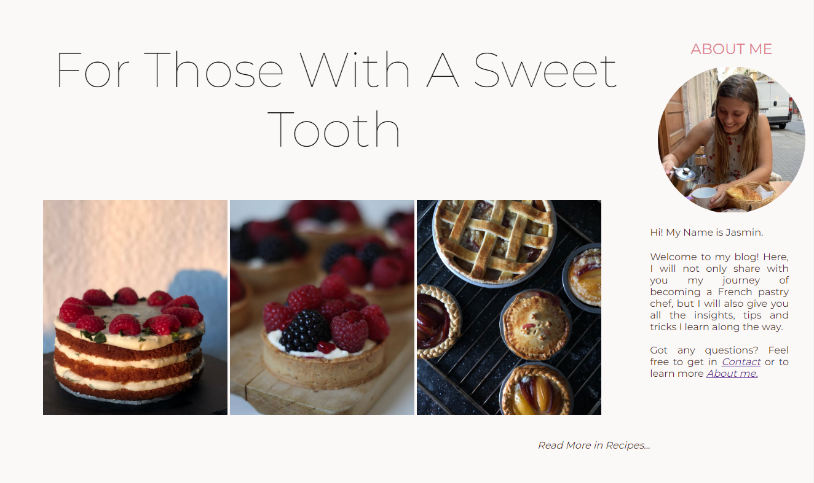

## Second Section- Sneak Peek Into My Classroom
- Maintaining the same visual concept the user is presented with a similar structure. This time below the image, with a responsive link the user gets redirected to the "Life As a Pastry Student" page.
- The image has a repetitive property turned on to make the object appear several times and create an illusion to the user of having various cakes.

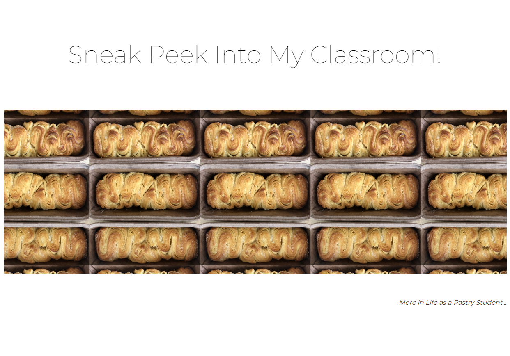

## Footer
- The footer is consistent on all the pages.
- Under the name of the website, the footer also contains a vertical nav bar to allow the user no navigate easier through the pages without having to scroll up.
- The last line is presented with social media accounts which open in a new tab.

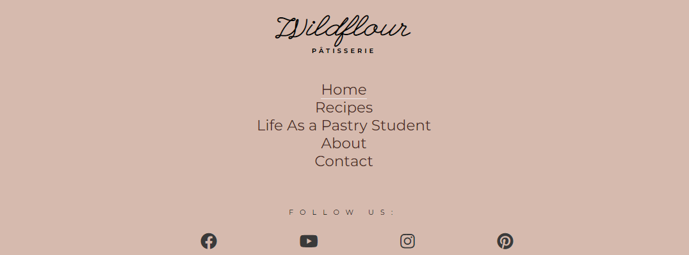

## Recipes Page
- Sample of one recipe, contains the name of the recipe on top, graphical representation on the side, and a catchphrase to catch the user's attention to click on the responsive link and be redirected to the specific recipe site (as this recipe is a mere illustration this link redirects back to the recipe page).

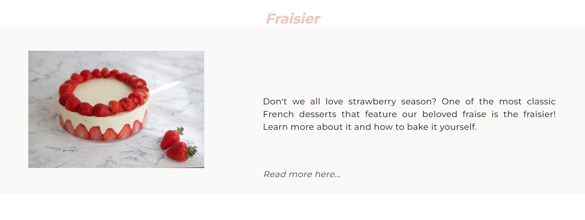

## Life As A Pastry Student
- Following a similar structure the user will be presented with sections where he can browse topics of personal interest and click on the link to obtain more information.

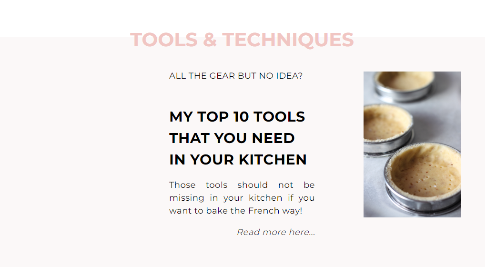

## About Page
- On this page, the user will be presented with one paragraph. Here goes a presentation from the author.
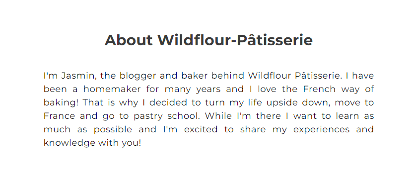

## Contact
- When the users want to reach out for more information, questions, partnership, or just appreciation they can do so by simply submitting a form with the required first name, last name, and email.

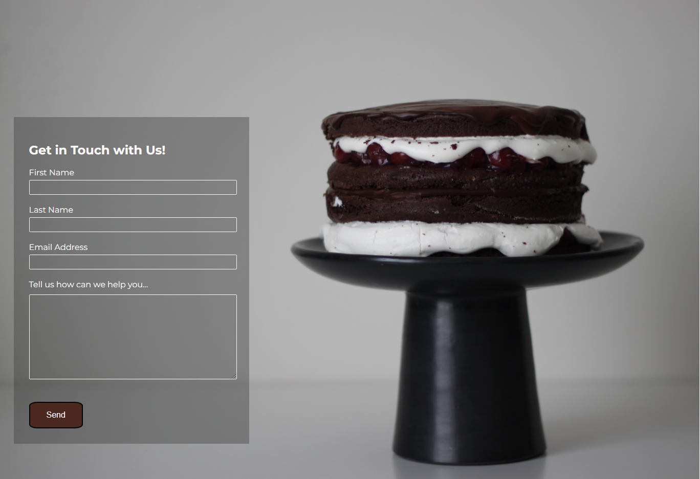

# Features Left To Implement
- Create one section mentioning the wedding cakes and showcase an image portfolio.
- Create more pages worth of recipes.
- Create a blog alike page after each topic on "life as a pastry student". Like and share buttons. Create a comment section to engage the users to participate. 
- Add a new page where the user would be redirected after the submission of the form.

# Testing

## Validator Testing
### Lighthouse
- The values obtained throughout the 5 pages of Accessibility, Best Practices, and SEO maintained a very constant range, from 94 to 100.
- The value obtained from all the pages for performance fluctuated more. The average represents 88.
(example run on "Life as a Pastry Student")
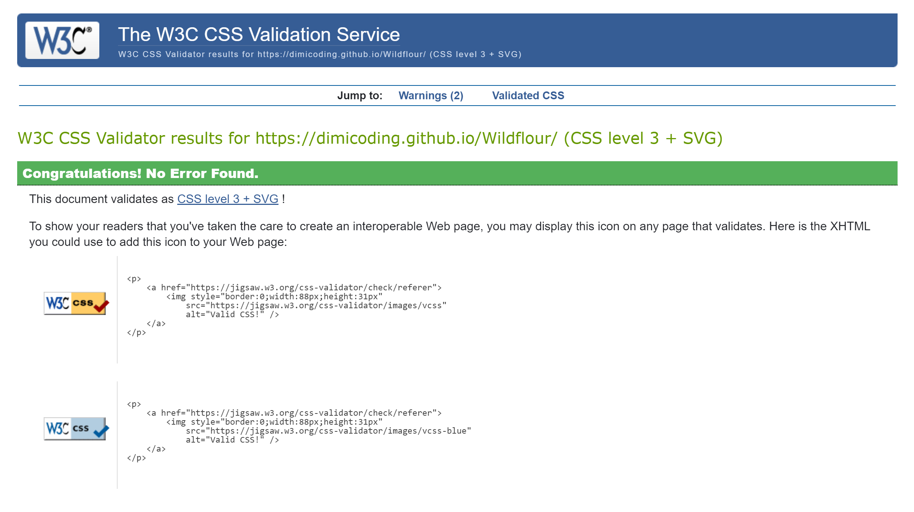

### W3C (HTML)
HTML passed the validator with no errors or warnings to show.

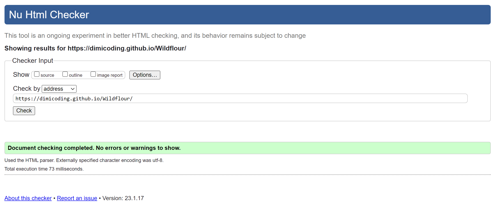

### Jigsaw (CSS)
CSS file passed the validator with no errors.
* 2 warnings on:
- 451       -webkit-right is a vendor extension
- 1030      -webkit-right is a vendor extension

## Responsiveness
- All website pages are responsive and tested on different browsers: Microsoft Edge, Chrome, Opera GX, and Mi(phone-Xiaomi). The following media queries were used:

- @media (min-width: 1281px)

- @media (min-width: 1025px) and (max-width: 1280px) 

- @media (min-width: 768px) and (max-width: 1024px) 

- @media (min-width: 768px) and (max-width: 1024px)

- @media (min-width: 481px) and (max-width: 767px) 

- @media (min-width: 320px) and (max-width: 480px)

# Fixed Bugs
- Both nav sections on the header and the footer were using an id attribute, having adapted to class on CSS and other *html files fixed the bug.
- On the Index page there were three headings using h1. Switching h1 to h2 and having only one main top heading erased the warning in the jigsaw validator. 
- Three images side by side in the home section were hard to control. After having learned how to properly use display: flex and justify-content as other functions I could have total control over where to display them.

# Deployment
For this project, I was using the Gitpod browser as a development environment from where I committed and pushed my last changes to my repository in GitHub.

To deploy the project first I had to do:
- Go to the GitHub repository Wildflour.
- Navigate to the Settings tab.
- Select the main branch and save.
- In one minute and after refreshing my browser the link has been successfully deployed.

To ensure that the link was up to date and running smoothly I refreshed on last time using the nav function called "actions".

The live link can be found here - https://dimicoding.github.io/Wildflour/

# Credits

- Code institute's template: https://github.com/Code-Institute-Org/gitpod-full-template
- Form adopted from the section on the contact page from Walkthrough Love Running project https://github.com/Code-Institute-Org/love-running-2.0
- Icons in the footer section were taken from the font awesome https://fontawesome.com/
- Fonts used from google fonts https://fonts.google.com/

- media queries range inspired by https://gist.github.com/gokulkrishh/242e68d1ee94ad05f488
- Examples of README files inspired by various milestone projects seen in (#peer-code-review), Code Institute https://github.com/Code-Institute-Solutions/readme-template/blob/master/README.md and https://github.com/marcin-kli/MP1/blob/Milestone-Projects/README.md#user-stories-testing .

- Inspiration for Recipe page from https://bonnibakery.com and https://plantifulbakery.com
- Ideas for the future blog "life as a pastry student" https://www.hummingbirdhigh.com/blog

# Acknowledgements
- To the whole Team at Code Institute.
- Thanks to Paul Thomas O’Riordan,  Cohort Facilitator for sharing tips, material, and personal experience from the very important early days.
- Thanks to my mentor Adegbenga Adeye for the feedback and disponibility.
- Special thanks to my girlfriend Jasmin Mayr to provide me with high-quality ideas and images for the Wildflour.

[Back To Table of Contents](#table-of-contents)

