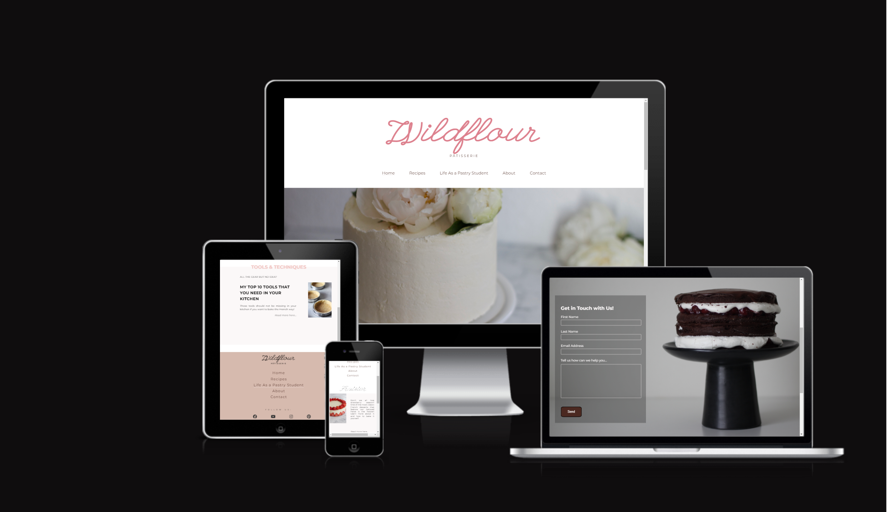

# Wildflour-Pâtisserie

Wildflour-Pâtisserie is a two-in-one website. 

On the one hand in recipes section, targueting amateurs and intermidiate bakers provides recipes of classic French cakes and desserts, modern modifications to classic recipes and sharing out personal experience of trying out recipes of popular French pastry chefs.
On the other hand, it also works as a blog. In the "Life As A Pastry Student", the main purpose is to inform, educate and entratain the audience. Here people with passion for baking will find personal insights into the everyday life of being a pastry student, sharing tips and techniques on how to improve baking skills and outlook to the life as a future pastry chef.

# Table of Contents

- [UX](#ux)
    - [Website owner business goals](#website-owner-business-goals)
    - [User goals](#user-goals)
        - [New user goals](#new-user-goals)
        - [Returning user goals](#returning-user-goals)
        - [Website owner business goals](#website-owner-business-goals)
    - [User stories](#user-stories)
    - [Structure of the website](#structure-of-the-website)
    - [Wireframes](#wireframes)
    - [Surface](#surface)
- [Features](#features)
- [Technology](#technology)
- [Testing](#testing)
    - [Functionality testing](#functionality-testing)
    - [Compatibility testing](#compatibility-testing)
    - [Code Validation](#code-validation)
    - [User stories testing](#user-stories-testing)
    - [Issues found during site development](#issues-found-during-site-development)
    - [Performance testing](#performance-testing)
- [Deployment](#deployment)
- [Credits](#credits)
- [Screenshots](#screenshots)
