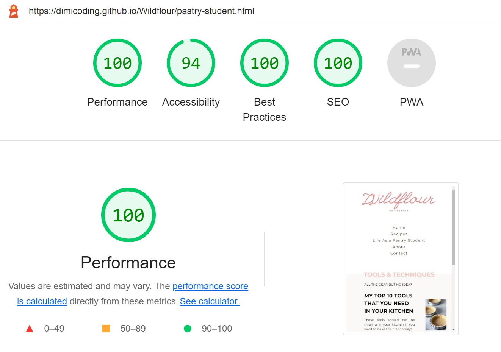

# Wildflour-Pâtisserie

Wildflour-Pâtisserie is a two-in-one website. 

On one hand in recipes section, targueting amateurs and intermidiate bakers provides recipes of classic French cakes and desserts, modern modifications to classic recipes and sharing out personal experience of trying out recipes of popular French pastry chefs.

On the other hand, it also works as a blog. In the "Life As A Pastry Student", the main purpose is to inform, educate and entratain the audience. Here people with passion for baking will find personal insights into the everyday life of being a pastry student, sharing tips and techniques on how to improve baking skills and outlook to the life as a future pastry chef.

## [View Website in Github pages](https://dimicoding.github.io/Wildflour/)

# Table of Contents

- [UX](#ux)
    - [Website owner business goals](#website-owner-business-goals)
    - [User goals](#user-goals)
        - [New user goals](#new-user-goals)
        - [Returning user goals](#returning-user-goals)
        - [Website owner business goals](#website-owner-business-goals)
    - [User stories](#user-stories)
    - [Structure of the website](#structure-of-the-website)
    - [Wireframes](#wireframes)
    - [Surface](#surface)
- [Features](#features)
- [Technology](#technology)
- [Testing](#testing)
    - [Functionality testing](#functionality-testing)
    - [Compatibility testing](#compatibility-testing)
    - [Code Validation](#code-validation)
    - [User stories testing](#user-stories-testing)
    - [Issues found during site development](#issues-found-during-site-development)
    - [Performance testing](#performance-testing)
- [Deployment](#deployment)
- [Credits](#credits)
- [Screenshots](#screenshots)

# UX

## Website owner business goals:
- Creation of the website will increse the notoriety of the baker to the public.
- Making classic French recipes available to an english-speaking audience.
- Giving out personal insights into studying at one of the most popular French pastry
schools.
- Foresight of future employment possibilities (eg.catering,wedding cakes).

## User Goals

### New User Goals:
- Easy and beginner friendly classic French recipes.
- The role of qualitative primary products.
- Current trends within the industry, especially in France.

### Returning User Goals: 
- Baking complex French pastries at home, e. g. croissants.
- Choosing a pastry school and program (program, duration, location, price,
language).
- The realistic everyday life of being a pastry student in France.

### User Strories

## Structure Of The Website
Easy to use and intuitive website. 
Responsive and adaptive to all types of screens so that the users can access from various devices without interference.

## Wireframes
To create a blueprint of the project I used Word and Balsamiq wireframes

## Surface

### Colors
Main colors used in this project:

### Fonts
- Headline 1 font wasn't available for free use, in this case I for main title was used League Script.
- Sub-Headings: Montserrat.
- Backup font: sans-serif, cursive.

### Images
All the images used in this website are personal.

# Features

## Navigation Bar
Displayed in all 5 pages of the website, it's full responsive and has a light underlining color when hover and when the page is active. From here the user can easily go to Home, Recipes, Life as a Pastry Student, About and Contact pages.
The main logo, when clicked also redirects to the home page.

## The Landing Page
Includes an image to activate curiosity when the user first lands this website and promote him to scroll down the page.

## First Section- Recipes and Aside Section
- On the left side is displayed a section with a big title, three sample images and a link that redirects the users to the recipes page.
- On the right side, the aside section presents with a brief apresentation of the author of the recipes and two links to go to the "contact" and "about" pages. 

## Second Section- Sneak Peek Into My Classroom
- Mantaing the same visual concept the user is presented with the similar structure. This time bellow the image, with a responsive link the user gets redirected to the "Life As a Pastry Student" page.
- The image has a repetitive property turned on to make the object appear several times and create an ilusion to the user of having various cakes.

## Footer
- Footer is consistant on all the pages.
- Under the name of the website, the footer also contains a vertical nav bar to allow the user no navigate easier trough the pages without having to scroll all the way up.
- Last line is presented with social media accounts which open in a new tab.

## Recipes Page
- Sample of one recipe, contains a name of the recipe on top, graphical representation on the side and a catch phrase to catch the users attention to click on the responsive link and be redirected to the specific recipe site (as this recipe is a mere illustration this link redirects back to the recipe page).

## Life As A Pastry Student
- Following a similar structure the user will be presented with sections where he can browse topics of personal interest and click on the link to obtain more information.

## About Page
- In this page the user will be presented with one paragraph. Here goas an apresentation from the author.

## Contact
- When the users want to reach out for more informations, questions, partnership or just apreciation they can do so by simply submiting a form with required first name, last name, and email.

# Features Left To Implement
- Create one section mentioning the wedding cakes and showcase an image portfolio.
- Create more pages worth of recipes.
- Create a blog alike page after each topic on the "life as a pastry student". Like and share buttons. Create a comment section to engage the users to participate. 
- Add a new page where the user would be redirected after the submition of the form.

# Testing

## Validator Testing
### Lighthouse
- The values obteined throughout the 5 pages of Accessibility, Best Practices and SEO mantained a very constant range, from 94 to 100.
- The value obteined from the all the pages for performance flactuated more. The avarege represents 88.
(exemple run on "Life as a Pastry Student")

